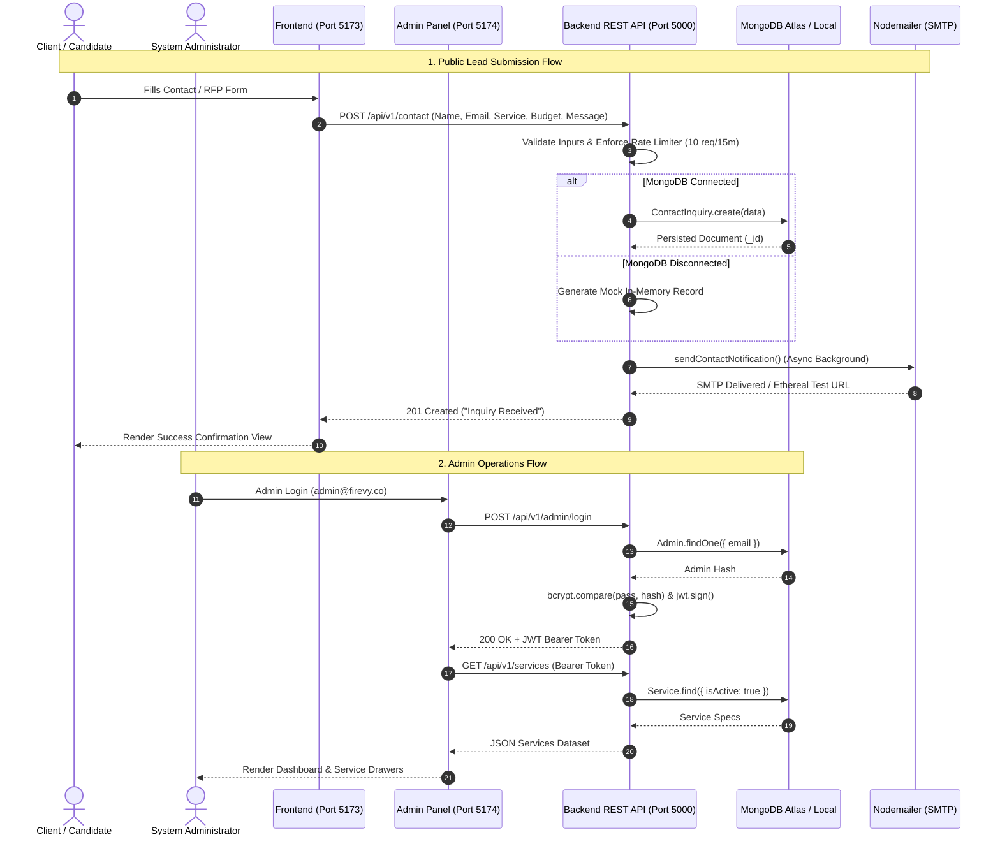

# Firevy.co Platform — Deep System Analysis, Architecture & Functionality Specification

> **Document Version:** 1.0.0  
> **Target System:** Firevy.co Enterprise IT & Software Solutions Platform  
> **Architecture Pattern:** Decoupled 3-Tier Web System (Client SPA + Admin Control Suite + Express/Node.js REST API + MongoDB)  
> **Last Updated:** September 2026  

---

## Table of Contents

1. [Executive Summary & System Objectives](#1-executive-summary--system-objectives)
2. [Deep System Analysis & Architectural Blueprint](#2-deep-system-analysis--architectural-blueprint)
   - [2.1 Architectural Topology](#21-architectural-topology)
   - [2.2 Data Flow & System Dynamics Diagram](#22-data-flow--system-dynamics-diagram)
   - [2.3 Security, Protection & Authentication Model](#23-security-protection--authentication-model)
3. [Comprehensive Functionality Breakdown (Module by Module)](#3-comprehensive-functionality-breakdown-module-by-module)
   - [3.1 Public Client Application (`frontend/`)](#31-public-client-application-frontend)
   - [3.2 Admin Control Suite (`admin-panel/`)](#32-admin-control-suite-admin-panel)
   - [3.3 Core Backend REST API Engine (`backend/`)](#33-core-backend-rest-api-engine-backend)
4. [Backend Integration Analysis: Attached vs. Can Be Attached](#4-backend-integration-analysis-attached-vs-can-be-attached)
   - [4.1 What IS ALREADY Attached to the Backend (Current Implementation)](#41-what-is-already-attached-to-the-backend-current-implementation)
   - [4.2 What CAN BE Attached to the Backend (Extension Roadmap & Architecture)](#42-what-can-be-attached-to-the-backend-extension-roadmap--architecture)
5. [End-to-End System Dynamics & Transaction Lifecycles](#5-end-to-end-system-dynamics--transaction-lifecycles)
   - [5.1 Lead Submission & Notification Lifecycle](#51-lead-submission--notification-lifecycle)
   - [5.2 Job Application & Talent Pipeline Lifecycle](#52-job-application--talent-pipeline-lifecycle)
   - [5.3 Dynamic CMS Resolution & Fallback Lifecycle](#53-dynamic-cms-resolution--fallback-lifecycle)
   - [5.4 Admin Authentication & Session Lifecycle](#54-admin-authentication--session-lifecycle)
6. [Environment Configuration & Deployment Specification](#6-environment-configuration--deployment-specification)
7. [Conclusion & Strategic Roadmap](#7-conclusion--strategic-roadmap)

---

## 1. Executive Summary & System Objectives

### 1.1 Overview
**Firevy.co** is a modern, enterprise-grade full-stack digital solutions platform built to showcase, manage, and scale software development services, case studies, technology stacks, recruitment pipelines, and commercial client acquisition for a high-end software consulting and engineering firm.

The system is engineered using a decoupled, multi-tier architectural approach comprising:
1. **Public Web Client (`frontend/`)**: High-performance React 18 Single Page Application (SPA) driven by Vite, Tailwind CSS, and Framer Motion with custom glassmorphic mega-menus, dynamic SEO injection (`react-helmet-async`), and dynamic service/case-study detail pages.
2. **Administrative Management Control Suite (`admin-panel/`)**: Dedicated, dark-themed operations dashboard featuring telemetry visualization, interactive data tables, service/case study drawers, ATS applicant tracker, lead inquiry manager, system feature toggles, and an integrated interactive REST API Playground.
3. **Core REST API Engine (`backend/`)**: Node.js and Express.js REST API with Mongoose ODM, MongoDB persistence, rate-limiting defenses, centralized error propagation, automated database seeder utilities, JWT authentication, and background SMTP email dispatch with automated test mailbox fallbacks.

```
+-----------------------------------------------------------------------------------------+
|                                    FIREVY.CO PLATFORM                                   |
+-----------------------------------------------------------------------------------------+
|  1. Public Client Portal       |  2. Admin Control Suite      |  3. Core REST API Engine |
|  - Lead capture & RFPs         |  - Telemetry & KPI analytics |  - Rate-limited routing  |
|  - Dynamic CMS & Case Studies  |  - Lead & ATS management     |  - Mongoose ODM & Mongo  |
|  - MegaMenu navigation         |  - API Testing Playground    |  - Dual fallback engine  |
|  - Career applications         |  - Settings & Feature flags  |  - SMTP mailer service   |
+--------------------------------+------------------------------+-------------------------+
```

---

### 1.2 System Objectives

#### Commercial & Business Objectives
* **Lead Acquisition & Conversion**: Capture high-intent inbound inquiries for software engineering projects through multi-tier RFP inquiry forms with automated notification dispatch to solution architects.
* **Brand Authority & Technical Trust**: Present verified case studies, metrics-driven client outcomes, certified technology stacks, client testimonials, and industry vertical domain expertise.
* **Talent Acquisition Engine**: Publicize engineering job openings and process candidate job applications with resume link capture and recruitment stage tracking.
* **Dynamic Content Management**: Allow instant updates to service specs, portfolio projects, open job positions, and corporate metadata without requiring frontend redeployments.

#### Technical Objectives
* **High Availability & Fault-Tolerant Resilience**: If MongoDB is unreachable or unseeded, the system automatically falls back to curated in-memory datasets (`initialData.js`) and dynamic slug synthesizers so that no page or API request ever returns a blank 500 failure to prospective clients.
* **Sub-Second Latency & Optimal Page Performance**: Leverage Vite-based code splitting, route-level lazy loading (`React.lazy` + `Suspense`), and optimized component rendering.
* **Strict Security Posture**: Enforce HTTP security headers (`Helmet`), CORS domain whitelisting, IP-based submission rate-limiting (`express-rate-limit`), bcrypt password hashing (cost factor 12), and cryptographically signed JSON Web Tokens (`jsonwebtoken`).
* **Clean Decoupling**: Complete separation between the public consumer-facing interface, the internal administration interface, and the backend data access layer.

---

## 2. Deep System Analysis & Architectural Blueprint

### 2.1 Architectural Topology

The platform operates across three isolated environments that interact over HTTPS/HTTP REST protocols:

```
                                +--------------------------------------+
                                |         PUBLIC INTERNET CLIENTS      |
                                +--------------------------------------+
                                                    |
                                    +---------------+---------------+
                                    |                               |
                                    v                               v
                    +-------------------------------+  +-------------------------------+
                    |     PUBLIC CLIENT SPA         |  |      ADMIN CONTROL SUITE      |
                    |     (React 18 / Vite)         |  |      (React 18 / Vite)        |
                    |     Port: 5173                |  |      Port: 5174 / 5175        |
                    +-------------------------------+  +-------------------------------+
                                    |                               |
                                    | (HTTP REST Requests)          | (JWT Auth + REST Requests)
                                    |                               |
                                    +---------------+---------------+
                                                    |
                                                    v
                                +---------------------------------------+
                                |        EXPRESS.JS REST API ENGINE     |
                                |        Port: 5000 /api/v1             |
                                +---------------------------------------+
                                    |                   |              |
                    +---------------+----+              |              +----------------+
                    |                    |              v                               |
                    v                    v      +---------------+                       v
        +-----------------------+  +----------+ | SMTP MAILER   |            +--------------------+
        | MONGODB PERSISTENCE   |  | FALLBACK | | Nodemailer /  |            | JWT AUTHENTICATION |
        | Collections:          |  | IN-MEM   | | Ethereal      |            | Token verification |
        | - services            |  | DATASET  | +---------------+            | & Admin Model      |
        | - portfolios          |  | initial- |                               +--------------------+
        | - jobs                |  | Data.js  |
        | - jobapplications     |  +----------+
        | - contactinquiries    |
        | - industries          |
        | - technologies        |
        | - testimonials        |
        | - admins              |
        +-----------------------+
```

---

### 2.2 Data Flow & System Dynamics Diagram



---

### 2.3 Security, Protection & Authentication Model

| Security Dimension | Implementation Mechanism | Purpose & Protection |
| :--- | :--- | :--- |
| **HTTP Security Headers** | `helmet({ contentSecurityPolicy: false })` | Mitigates XSS, MIME-sniffing, clickjacking, and header injection. |
| **Cross-Origin Resource Sharing (CORS)** | `cors({ origin: [config.clientUrl, 'http://localhost:5173'], credentials: true })` | Restricts cross-origin API calls to authorized clients. |
| **Rate Limiting** | `express-rate-limit` on `/contact` & `/applications` (10 requests / 15 mins) | Protects submission gateways against bot spam and DoS attacks. |
| **Password Hashing** | `bcryptjs` with salt round `12` | Cryptographic one-way hashing for admin passwords in MongoDB. |
| **Admin Authorization** | `jsonwebtoken` (JWT) signed with secret key, 24h expiration | Stateless authorization verification for administrative routes. |
| **Input Sanitization** | Controller-level required-field checking & Mongoose schema trim | Prevents whitespace pollution and malformed payloads. |
| **Centralized Error Boundary** | `errorHandler.js` + `asyncHandler.js` wrapper | Catches uncaught exceptions without leaking server stack traces in production. |

---

## 3. Comprehensive Functionality Breakdown (Module by Module)

### 3.1 Public Client Application (`frontend/`)

The public client is an interactive corporate web portal that handles lead acquisition, portfolio presentation, tech stack exploration, and candidate recruitment.

```
frontend/src/
|-- assets/               # Brand logos, icons, illustrations
|-- components/
|   |-- common/           # Reusable atomic UI (Button, Input, Modal, Badge, SEO, Select, Textarea, etc.)
|   |-- home/             # 14 home page sections (Hero, Marquee, Stats, Ecosystem, Showcase, etc.)
|   |-- layout/           # Header, Footer, Layout wrapper, MegaMenu, ScrollToTop
|-- constants/            # Brand configuration, corporate contact numbers, emails
|-- pages/                # 15 route pages (Home, About, Services, ServiceDetails, CompanySubDetails, etc.)
|-- services/             # 8 Axios API services (serviceApi, portfolioApi, jobApi, contactApi, etc.)
|-- App.jsx               # React Router v6 route mapping with Suspense code splitting
```

#### Feature & Page Matrix

```
+----------------------------------------------------------------------------------------------------------+
|                                    PUBLIC CLIENT PAGES & MODULES                                         |
+----------------------------------------------------------------------------------------------------------+
| Route                       | Primary Component        | Data Source               | Key Capabilities    |
+-----------------------------+--------------------------+---------------------------+---------------------+
| `/`                         | `Home.jsx`               | Multi-API + Brand Stats   | Full landing page   |
| `/about`                    | `About.jsx`              | Brand Constants           | Vision, mission     |
| `/services`                 | `Services.jsx`           | `GET /api/v1/services`    | Offerings grid      |
| `/services/:slug`           | `ServiceDetails.jsx`     | `GET /api/v1/services/:s` | Dynamic architecture|
| `/portfolio`                | `Portfolio.jsx`          | `GET /api/v1/portfolio`   | Case studies filter |
| `/portfolio/:slug`          | `PortfolioDetails.jsx`   | `GET /api/v1/portfolio/:s`| Impact metrics view |
| `/careers`                  | `Careers.jsx`            | `GET /api/v1/jobs`        | ATS application modal|
| `/contact`                  | `Contact.jsx`            | `POST /api/v1/contact`    | Interactive RFP form|
| `/industries`               | `Industries.jsx`         | `GET /api/v1/industries`  | Industry matrices   |
| `/technologies`             | `Technologies.jsx`       | `GET /api/v1/technologies`| 19+ certified techs |
| `/process`                  | `Process.jsx`            | Brand Process Constants   | 4-stage agile cycle |
| `/company/:slug`            | `CompanySubDetails.jsx`  | Local Slug Dictionary     | 17 sub-detail pages |
| `/privacy-policy` & `/terms`| `PrivacyPolicy`, `Terms` | Legal Compliance Text     | Data governance     |
+----------------------------------------------------------------------------------------------------------+
```

#### Deep Dive into Key Frontend Modules

1. **Dynamic Navigation & MegaMenu System (`Header.jsx` & `MegaMenu.jsx`)**:
   - **Utility Top Bar**: Disappears on scroll; features live US (`+1 (800) 592-7410`) and India sales telephone channels, direct email contact, and quick meeting booking links.
   - **Sticky Navigation**: Smooth background transition from transparent dark gradient to solid blurred white (`backdrop-blur-xl`) upon scrolling past 30px.
   - **Hover Grace Period**: Uses a `250ms` debounced timeout ref so dropdowns do not disappear abruptly when the user moves their cursor between nav elements.
   - **Full-Width Glassmorphism MegaMenu**: 6 dedicated dropdown templates (`company`, `solutions`, `services`, `technologies`, `hire-developers`, `our-work`) rendering rich columns of capabilities, featured case studies, and instant CTAs.

2. **Dynamic Service Architecture Engine (`ServiceDetails.jsx`)**:
   - Matches route parameter `/services/:slug` (e.g. `/services/ai-machine-learning`, `/services/cloud-solutions`, `/services/web-development`).
   - Fetches deep service specifications from the backend API.
   - Dynamically renders:
     - Hero banner with custom capability icons.
     - Enterprise feature checklists with verified status markers.
     - Certified technology tags.
     - 4-step agile delivery lifecycle process cards (`Discovery`, `Engineering`, `QA`, `Production`).
     - Interactive accordion FAQ widget with smooth expanding answers.

3. **Dynamic Company Sub-Details Engine (`CompanySubDetails.jsx`)**:
   - Provides rich, dedicated subpages for **17 distinct company routes** under `/company/:slug` including:
     - `/company/about-firevy`, `/company/ceo-message`, `/company/our-team`, `/company/events-activities`
     - `/company/brochure`, `/company/why-choose-us`, `/company/great-place-to-work`, `/company/women-empowerment`
     - `/company/awards-recognition`, `/company/blog`, `/company/csr`, `/company/podcast`
     - `/company/delivery-models`, `/company/engagement-models`, `/company/development-methodology`
     - `/company/client-testimonials`, `/company/clutch-testimonial`
   - Incorporates a dynamic fallback generator for any unmapped slug, automatically formatting titles and assigning enterprise badges.

4. **Interactive Lead Acquisition Engine (`Contact.jsx`)**:
   - Uses `react-hook-form` with regex email and phone validation.
   - Collects customer name, corporate email, phone, company name, required service, budget bracket, and project overview.
   - Sends payload to `POST /api/v1/contact`.
   - On completion, transitions into an animated confirmation view with a reset option.

5. **Recruitment & Job Application Pipeline (`Careers.jsx`)**:
   - Loads open positions dynamically from `GET /api/v1/jobs`.
   - Displays position metadata: department badge, contract type (`Full-time`, `Contract`), location (`San Francisco / Remote`), and job descriptions.
   - Features an **Interactive Application Modal**: Captures applicant name, email, phone, resume/portfolio URL, and cover notes, dispatching directly to `POST /api/v1/applications`.

---

### 3.2 Admin Management Control Suite (`admin-panel/`)

The Admin Panel is a dedicated, production-ready operational workstation designed for company executives, recruitment leads, and system administrators.

```
admin-panel/src/
|-- components/
|   |-- Layout/           # Sidebar (collapsible), Header, Footer, AdminLayout wrapper
|   |-- UI/               # StatCard, Charts (Area, Donut, Bar), DataTable, Drawer, Modal, Badge, JsonViewer
|-- context/
|   |-- AuthContext.jsx   # Admin authentication provider with persistent localStorage session
|   |-- ToastContext.jsx  # Toast notification provider
|-- pages/
|   |-- Dashboard.jsx          # Live metric cards, request velocity charts, sector split, leads preview
|   |-- ServicesPage.jsx       # Services table, service spec drawer, draft creation modal
|   |-- PortfolioPage.jsx      # Case studies table, category tabs, impact metrics inspector, creation modal
|   |-- JobsPage.jsx           # Open roles registry, responsibilities & requirements drawer
|   |-- ApplicationsPage.jsx   # Talent pipeline ATS, candidate stage selector, live API test modal
|   |-- InquiriesPage.jsx      # Lead inbox, status changer, direct mailto integration, live API test modal
|   |-- IndustriesPage.jsx     # Vertical industry domains matrix and cards
|   |-- TechnologiesPage.jsx   # Technology registry with category filtering
|   |-- TestimonialsPage.jsx   # Client testimonial catalog with star ratings and excerpts
|   |-- SettingsPage.jsx       # Corporate profile settings & feature gate toggles
|   |-- ApiPlaygroundPage.jsx  # Interactive REST API testing console with execution timers
|   |-- LoginPage.jsx          # JWT login portal with error alerts
|   |-- NotFoundPage.jsx       # 404 admin route fallback
|-- services/
|   |-- api.js                 # Axios instance with Bearer token interceptors & error normalizing
|   |-- adminService.js        # API service catalog + raw request execution engine
|   |-- storageService.js      # LocalStorage persistence layer for offline simulation & activity logs
```

#### Admin Page Deep-Dive Breakdown

```
+---------------------------------------------------------------------------------------------------------+
|                                  ADMIN PANEL PAGES & CAPABILITIES                                       |
+---------------------------------------------------------------------------------------------------------+
| Module                      | Functionality & User Experience                                           |
+-----------------------------+---------------------------------------------------------------------------+
| **Authentication**          | Login form authenticating with `POST /api/v1/admin/login`. Stores token.  |
| **Executive Dashboard**     | Live aggregation of 8 system metrics (`Promise.allSettled`), charts.     |
| **Services Registry**       | Searchable services table, Drawer spec inspector, service draft modal.   |
| **Portfolio Manager**       | Case study table, category filters (`AI`, `Web`, `Cloud`), creation modal.|
| **Job Positions**           | Open job specs with requirement & responsibility drawer inspections.     |
| **ATS Applications**        | Candidate pipeline with 5 hiring stages (`Screening` -> `Offer`), tests.  |
| **Inquiries Inbox**         | Inbound leads management with 5 lead stages (`New` -> `Won`), mailto links|
| **Industry Domains**        | Grid & table matrix of 8 industry verticals with associated services.     |
| **Tech Registry**           | 19+ certified technologies categorized by runtime domain.                 |
| **Testimonials**            | Verified reviews with 5-star ratings, NPS metrics, executive avatars.     |
| **Settings & Features**     | Corporate contact details & live boolean feature toggles.                 |
| **API Playground**          | Live HTTP client with 12 preset routes, JSON payload editor, ms latency.  |
+---------------------------------------------------------------------------------------------------------+
```

1. **Executive Dashboard (`Dashboard.jsx`)**:
   - Dispatches parallel `Promise.allSettled` queries to fetch live service counts, portfolio case studies, active job openings, industries, technologies, and testimonials.
   - Displays 4 primary KPI StatCards: Active Services, Case Studies, Open Positions, and Client Inquiries.
   - Renders interactive canvas-style analytical visualizations:
     - **Area Chart**: Displays monthly inquiry and API request velocity.
     - **Donut Chart**: Shows distribution of clients across industry sectors.
     - **Bar Chart**: Breakdown of certified technologies across domains.
   - Shows a fast-access table of recent inbound leads with status badges.

2. **Services Architecture Registry (`ServicesPage.jsx`)**:
   - Lists all company offerings with technology count badges and delivery process steps.
   - Clicking **Inspect** opens a slide-over `Drawer` displaying full technical specifications, feature checklists, and agile steps.
   - Clicking **Add Service Spec** opens a modal to draft and register new service blueprints.

3. **Inbound Leads & Client Inquiries Manager (`InquiriesPage.jsx`)**:
   - Centralized inbox of prospective client inquiries.
   - Inline status dropdown updates leads across: `New`, `Contacted`, `In Progress`, `Closed`, `Won`.
   - **Inspect Drawer**: Reveals full customer metadata, service requested, budget bracket, and raw client requirements. Includes a `Send Direct Email` mailto action.
   - **Submit Test Inquiry Button**: Directly triggers a live HTTP request to `POST /api/v1/contact` to verify backend email dispatch and DB persistence in real time.

4. **ATS Talent Pipeline & Applications (`ApplicationsPage.jsx`)**:
   - Manages submitted candidate applications.
   - Inline stage dropdown moves applicants through: `Applied`, `Screening`, `Interview`, `Offer`, `Rejected`.
   - Displays external profile/resume links and candidate cover messages.
   - **Submit Test Application Button**: Sends live payloads to `POST /api/v1/applications`.

5. **Platform Configuration & Feature Gateways (`SettingsPage.jsx`)**:
   - Edit corporate identity values: Company Name, Tagline, Primary Sales Email, Support Phone, HQ Physical Address.
   - **Feature Gateways**: Interactive boolean toggles for frontend modules (`careersPortal`, `caseStudies`, `clientInquiries`).
   - Displays real-time API target information, CORS configurations, and Helmet security status.

6. **Interactive REST API Playground (`ApiPlaygroundPage.jsx`)**:
   - Fully featured embedded API client (similar to Postman/Insomnia) built directly into the admin interface.
   - **12 Preset Routes**: Health check, services, portfolio filtering, jobs, technologies, settings, contact submission, candidate application, etc.
   - Select HTTP method (`GET`, `POST`, `PUT`, `DELETE`), customize URL endpoints, and edit raw JSON payloads.
   - Measures and displays exact response execution latency in milliseconds (`durationMs`).
   - Renders formatted JSON tree output with syntax highlighting via `JsonViewer.jsx`.

---

### 3.3 Core Backend REST API Engine (`backend/`)

The backend is built with Node.js and Express.js, providing a robust, modular, and fault-tolerant REST API.

```
backend/src/
|-- config/
|   |-- db.js                 # Mongoose database connection with retry logging
|   |-- env.js                # Environment variable normalization & defaults
|-- controllers/
|   |-- adminController.js        # Admin login & JWT creation
|   |-- serviceController.js      # Services listing & slug resolution with fallback
|   |-- portfolioController.js    # Portfolio listing, filtering & slug resolution
|   |-- jobController.js          # Job openings listing & lookup
|   |-- applicationController.js  # Candidate job application submission
|   |-- contactController.js      # Contact inquiry submission & mailer trigger
|   |-- industryController.js     # Industry sector listing
|   |-- technologyController.js   # Technology registry listing
|   |-- testimonialController.js  # Testimonials listing
|   |-- settingsController.js     # Platform settings & feature flags
|-- middleware/
|   |-- asyncHandler.js       # Higher-order async route wrapper
|   |-- errorHandler.js       # Centralized error formatter
|-- models/
|   |-- Admin.js              # Admin credentials & role schema
|   |-- Service.js            # Services, features, process, FAQ schema
|   |-- Portfolio.js          # Case studies, challenges, solutions, results schema
|   |-- Job.js                # Job positions, responsibilities, requirements schema
|   |-- JobApplication.js     # Candidate submissions schema
|   |-- ContactInquiry.js     # Inbound client leads schema
|   |-- Industry.js           # Industry domains schema
|   |-- Technology.js         # Tech registry schema
|   |-- Testimonial.js        # Client testimonials & reviews schema
|-- routes/
|   |-- adminRoutes.js        # /api/v1/admin
|   |-- serviceRoutes.js      # /api/v1/services
|   |-- portfolioRoutes.js    # /api/v1/portfolio
|   |-- jobRoutes.js          # /api/v1/jobs
|   |-- applicationRoutes.js  # /api/v1/applications
|   |-- contactRoutes.js      # /api/v1/contact
|   |-- industryRoutes.js     # /api/v1/industries
|   |-- technologyRoutes.js   # /api/v1/technologies
|   |-- testimonialRoutes.js  # /api/v1/testimonials
|   |-- settingsRoutes.js     # /api/v1/settings
|-- services/
|   |-- mailerService.js      # Nodemailer SMTP transporter + Ethereal fallback
|-- utils/
|   |-- apiResponse.js        # Standardized { success, message, data } formatter
|   |-- createAdmin.js        # CLI utility to seed initial Admin account
|   |-- initialData.js        # 36KB comprehensive fallback and seed dataset
|   |-- seed.js               # CLI utility to populate MongoDB collections
|-- app.js                    # Express app initialization & route mounting
|-- server.js                 # HTTP listener & startup banner
```

---

## 4. Backend Integration Analysis: Attached vs. Can Be Attached

This section provides a rigorous, code-verified audit comparing what is currently connected to the backend versus what can be extended.

### 4.1 What IS ALREADY Attached to the Backend (Current Implementation)

The following table details all active routes, controllers, database models, and their client connections:

```
+-------------------------------------------------------------------------------------------------------------------------+
|                                    CURRENT BACKEND ATTACHMENTS MATRIX                                                   |
+-------------------------------------------------------------------------------------------------------------------------+
| Route Path                | Method | Controller Function      | DB Model         | Fallback Strategy   | Connected In   |
+---------------------------+--------+--------------------------+------------------+---------------------+----------------+
| `/api/v1/health`          | `GET`  | Inline (`app.js`)        | None             | Static JSON         | Admin / Client |
| `/api/v1/admin/login`     | `POST` | `loginAdmin`             | `Admin`          | Returns 401 error   | Admin Panel    |
| `/api/v1/services`        | `GET`  | `getServices`            | `Service`        | `initialServices`   | Public & Admin |
| `/api/v1/services/:slug`  | `GET`  | `getServiceBySlug`       | `Service`        | Dynamic Generator   | Public & Admin |
| `/api/v1/portfolio`       | `GET`  | `getPortfolio`           | `Portfolio`      | Filtered initialData| Public & Admin |
| `/api/v1/portfolio/:slug` | `GET`  | `getPortfolioBySlug`     | `Portfolio`      | `initialPortfolio`  | Public & Admin |
| `/api/v1/jobs`            | `GET`  | `getJobs`                | `Job`            | `initialJobs`       | Public & Admin |
| `/api/v1/jobs/:id`        | `GET`  | `getJobById`             | `Job`            | Find in initialJobs | Public & Admin |
| `/api/v1/contact`         | `POST` | `createContactInquiry`   | `ContactInquiry` | Mock Object + Mail  | Public & Admin |
| `/api/v1/applications`    | `POST` | `createJobApplication`   | `JobApplication` | Mock Object         | Public & Admin |
| `/api/v1/industries`      | `GET`  | `getIndustries`          | `Industry`       | `initialIndustries` | Public & Admin |
| `/api/v1/technologies`    | `GET`  | `getTechnologies`        | `Technology`     | `initialTechnologies` Public & Admin |
| `/api/v1/testimonials`    | `GET`  | `getTestimonials`        | `Testimonial`    | `initialTestimonials` Public & Admin |
| `/api/v1/settings`        | `GET`  | `getSettings`            | Static Object    | Default Config      | Public & Admin |
+-------------------------------------------------------------------------------------------------------------------------+
```

#### Key Capabilities Currently Operational:
1. **Dynamic Content Fetching**: Both the public frontend and admin panel fetch live data for Services, Portfolio Case Studies, Jobs, Industries, Technologies, and Testimonials.
2. **Dynamic Slug Generator**: If an unknown slug is requested (e.g. `/services/quantum-computing`), the backend dynamically constructs a complete service specification object on the fly, preventing broken links.
3. **Lead & Application Ingestion**: Public forms submit real HTTP payloads to `/contact` and `/applications`. If MongoDB is live, records are saved; if offline, mock records are returned without breaking the frontend UX.
4. **Automated Background Email Dispatch**: Every `/contact` submission triggers `mailerService.js` to dispatch an HTML notification. If custom SMTP credentials are not configured, it creates an ethereal.email test inbox and outputs the preview URL to the console.
5. **Secure Admin Authentication**: Validates credentials against hashed passwords in MongoDB and generates signed JWT tokens.

---

### 4.2 What CAN BE Attached to the Backend (Extension Roadmap & Architecture)

While read operations and lead/application submissions are fully integrated, several advanced capabilities can be attached to transform the platform into an end-to-end enterprise CMS and operations hub:

```
+---------------------------------------------------------------------------------------------------------------+
|                               POTENTIAL BACKEND EXTENSIONS & ROADMAP                                          |
+---------------------------------------------------------------------------------------------------------------+
| Extension Domain            | Proposed Endpoints / Services            | Architectural Purpose                |
+-----------------------------+------------------------------------------+--------------------------------------+
| **1. Admin Full CRUD APIs** | `POST/PUT/DELETE /api/v1/services`       | Full database CMS control for admin  |
|                             | `POST/PUT/DELETE /api/v1/portfolio`      | to create, edit, and delete content  |
|                             | `POST/PUT/DELETE /api/v1/jobs`           | without redeploying code.            |
|                             | `POST/PUT/DELETE /api/v1/testimonials`   |                                      |
| **2. Admin Inquiries & ATS**| `GET/PATCH/DELETE /api/v1/contact`       | Move Inquiries & ATS from local      |
|    **Database Sync**        | `GET/PATCH/DELETE /api/v1/applications`  | storage to persistent MongoDB queries|
| **3. Cloud File & Asset**   | `POST /api/v1/upload`                    | Handle PDF resumes, case study cover |
|    **Storage Engine**       | (AWS S3 / Cloudinary / Supabase Storage) | images, and corporate assets.        |
| **4. Real-Time WebSockets** | Socket.io / WebSocket Server             | Real-time alerts on new leads,       |
|    **Event Gateway**        |                                          | live visitor telemetry on dashboard. |
| **5. AI & LLM Copilot**     | `POST /api/v1/ai/qualify-lead`           | Auto-score leads, auto-summarize     |
|    **Pipeline**             | `POST /api/v1/ai/screen-resume`          | candidate resumes using OpenAI/RAG.  |
| **6. CRM & Webhook Hub**    | Webhooks to HubSpot, Salesforce, Slack   | Pipe inquiries directly to sales     |
|                             | Discord channel notification bots        | Slack channels and CRM pipelines.    |
| **7. Billing & Payments**   | `POST /api/v1/billing/create-checkout`   | Client retainer payments, sprint     |
|                             | (Stripe / LemonSqueezy integration)      | deposits, and invoice settlement.    |
| **8. Enhanced Auth & SSO**  | OAuth2 (Google / GitHub SSO), 2FA/MFA    | Enterprise single sign-on and token  |
|                             | Redis session store & refresh tokens     | rotation security.                   |
| **9. Observability & APM**  | Prometheus metrics (`/metrics`), Sentry  | Production crash telemetry, API      |
|                             | Winston structured JSON logger           | latency tracking & SLA monitors.     |
+---------------------------------------------------------------------------------------------------------------+
```

#### Detailed Architecture for Top Proposed Extensions:

#### Extension 1: Complete Admin Database CRUD Suite
Currently, adding a service or case study in the admin panel updates component state or localStorage. Adding the following controller endpoints will enable full database synchronization:
* `POST /api/v1/services` — Create new service specification in MongoDB.
* `PUT /api/v1/services/:id` — Update existing service specification.
* `DELETE /api/v1/services/:id` — Soft-delete (`isActive: false`) or remove service.
* `GET /api/v1/contact` (Protected) — Fetch all client inquiries with status filters (`New`, `In Progress`, `Won`).
* `PATCH /api/v1/contact/:id/status` (Protected) — Update lead status in database.
* `GET /api/v1/applications` (Protected) — Fetch all candidate applications with stage filters.
* `PATCH /api/v1/applications/:id/stage` (Protected) — Move candidate through hiring stages (`Screening` -> `Offer`).

#### Extension 2: Cloud File Upload Pipeline (AWS S3 / Cloudinary)
Currently, candidate resumes and portfolio images accept URL strings. Adding `multer` and AWS S3/Cloudinary will enable direct file uploads:
```javascript
// Example architecture for backend/src/routes/uploadRoutes.js
router.post('/upload/resume', authMiddleware, upload.single('resume'), async (req, res) => {
  // Streams PDF directly to S3 bucket and returns public CDN URL
});
```

#### Extension 3: Real-Time Event Dispatcher (Socket.io)
Integrating a WebSocket server onto the Express HTTP listener will enable:
* Instant audio/visual toast notifications inside the Admin Panel whenever a client submits an RFP.
* Live visitor counters on the Admin Dashboard.
* Live collaborative notes on applicant tracking cards.

#### Extension 4: AI-Powered Lead Scoring & RFP Analysis
Integrating an LLM pipeline (via LangChain or OpenAI SDK) to automatically analyze incoming contact messages:
* Extract budget intent, required tech stack, and estimated timeline.
* Assign a Lead Score (1-100) and draft an initial response email for the solutions architect.

---

## 5. End-to-End System Dynamics & Transaction Lifecycles

### 5.1 Lead Submission & Notification Lifecycle

```
[ Prospective Client ]
        |
        | 1. Submits RFP Form (Name, Email, Budget, Message)
        v
[ Frontend (Contact.jsx) ]
        |
        | 2. POST /api/v1/contact
        v
[ Backend Rate Limiter ] ---> (Blocks if > 10 requests / 15 mins)
        |
        | 3. Validates Payload
        v
[ Contact Controller ]
        |
        +---> 4a. Persists to MongoDB (ContactInquiry Model)
        |
        +---> 4b. Dispatches HTML Email via Nodemailer (Background Worker)
        |
        v
[ API Response: 201 Created ]
        |
        v
[ Frontend Success View ] ---> Client sees confirmation & SLA promise (24h)
```

---

### 5.2 Job Application & Talent Pipeline Lifecycle

```
[ Engineering Candidate ]
        |
        | 1. Views Open Positions on /careers
        | 2. Clicks "Apply Now" -> Fills Modal with LinkedIn/Resume URL
        v
[ Frontend (Careers.jsx) ]
        |
        | 3. POST /api/v1/applications
        v
[ Backend Application Controller ]
        |
        | 4. Saves JobApplication record (status: 'Submitted')
        v
[ API Response: 201 Created ]
        |
        v
[ Admin ATS Dashboard ]
        |
        | 5. Recruiter reviews application & moves stage:
        |    'Applied' -> 'Screening' -> 'Interview' -> 'Offer'
        v
[ Persistent Status Update in DB ]
```

---

### 5.3 Dynamic CMS Resolution & Fallback Lifecycle

```
[ Client Request: GET /services/blockchain-audit ]
                        |
                        v
        [ Service Controller: getServiceBySlug ]
                        |
            +-----------+-----------+
            |                       |
    (Step 1: DB Lookup)     (DB Unreachable / Missing)
            |                       |
    [ Found in MongoDB? ]           v
      /           \         [ Step 2: Search initialData.js ]
    (Yes)         (No)              |
     |             |        [ Found in initialData? ]
     |             |          /           \
     |             +-------->(No)         (Yes)
     |                        |             |
     |                        v             v
     |              [ Step 3: Dynamic Slug  [ Return initialData ]
     |                Generator (Auto-Title,       |
     |                Tech, Process & FAQs) ]      |
     |                        |                    |
     +------------------------+--------------------+
                              |
                              v
                [ 200 OK: Full JSON Service Spec ]
                              |
                              v
            [ Frontend renders rich ServiceDetails page ]
```

---

### 5.4 Admin Authentication & Session Lifecycle

```
[ Admin User ]
      |
      | 1. Submits email & password on /admin
      v
[ Admin Panel (LoginPage.jsx) ]
      |
      | 2. POST /api/v1/admin/login
      v
[ Backend Admin Controller ]
      |
      | 3. Admin.findOne({ email })
      | 4. bcrypt.compare(password, admin.password)
      | 5. jwt.sign({ adminId, role }, JWT_SECRET, { expiresIn: '1d' })
      v
[ 200 OK + JWT Bearer Token ]
      |
      | 6. Stored in localStorage ('firevy_admin_active_session')
      v
[ ProtectedRoute Grants Access to /admin/dashboard ]
      |
      | 7. Subsequent API calls include: 'Authorization: Bearer <TOKEN>'
      v
[ Admin Panel Synchronizes Live System Telemetry ]
```

---

## 6. Environment Configuration & Deployment Specification

### 6.1 Environment Variable Matrix

#### Backend Configuration (`backend/.env`)
| Variable Key | Example Value | Description |
| :--- | :--- | :--- |
| `PORT` | `5000` | HTTP port for the Express REST API server |
| `NODE_ENV` | `development` / `production` | Runtime mode (affects logging verbosity & error traces) |
| `MONGO_URI` | `mongodb://127.0.0.1:27017/firevy_db` | MongoDB connection URI (local or MongoDB Atlas) |
| `JWT_SECRET` | `firevy_enterprise_secure_jwt_secret_key_2026` | Secret key used to sign and verify admin session tokens |
| `CLIENT_URL` | `http://localhost:5173` | Allowed CORS client origin |
| `SMTP_HOST` | `smtp.ethereal.email` / `smtp.gmail.com` | Outbound mail server hostname |
| `SMTP_PORT` | `587` / `465` | SMTP port (587 for TLS, 465 for SSL) |
| `SMTP_USER` | `your_email@firevy.co` | SMTP authentication username |
| `SMTP_PASS` | `your_smtp_app_password` | SMTP authentication password |
| `SMTP_FROM_NAME` | `Firevy Solutions` | Display name on outbound notification emails |
| `SMTP_FROM_EMAIL`| `contact@firevy.co` | Sender email address on outbound notification emails |

#### Public Frontend Configuration (`frontend/.env`)
| Variable Key | Example Value | Description |
| :--- | :--- | :--- |
| `VITE_API_URL` | `http://localhost:5000/api/v1` | Target backend REST API base URL |

#### Admin Panel Configuration (`admin-panel/.env`)
| Variable Key | Example Value | Description |
| :--- | :--- | :--- |
| `VITE_API_URL` | `http://localhost:5000/api/v1` | Target backend REST API base URL for admin operations |

---

### 6.2 Quick Start & Operations Guide

#### 1. Backend Server Setup
```bash
# Navigate to backend directory
cd backend

# Install dependencies
npm install

# (Optional) Seed demo services, case studies, jobs, tech registry & testimonials into MongoDB
npm run seed

# (Optional) Provision admin account via CLI or environment variables
node src/utils/createAdmin.js <admin_email> <admin_password>

# Launch development API server with hot-reload
npm run dev
# Server active at http://localhost:5000 (Health Check: http://localhost:5000/api/v1/health)
```

#### 2. Public Frontend Client Setup
```bash
# Navigate to frontend directory
cd frontend

# Install dependencies
npm install

# Launch Vite development server
npm run dev
# Public portal active at http://localhost:5173
```

#### 3. Admin Control Suite Setup
```bash
# Navigate to admin-panel directory
cd admin-panel

# Install dependencies
npm install

# Launch Vite development server
npm run dev
# Admin portal active at http://localhost:5174 (or 5175) -> Navigate to /admin
```

---

## 7. Conclusion & Strategic Roadmap

The **Firevy.co** platform represents an enterprise-grade digital solutions architecture. Its key architectural strengths include:
* **Decoupled 3-Tier Separation**: Clean division between the consumer-facing public client, internal operational management suite, and backend service persistence layer.
* **Dual-Tier Data Resilience**: Zero downtime or broken pages even if database clusters or email transporters experience temporary outages.
* **Modern Developer & User Experience**: Powered by React 18, Vite, Framer Motion, and Tailwind CSS with rich micro-animations, glassmorphism aesthetics, and responsive layout structures.
* **Extensible REST Foundation**: A clear, modular foundation ready to be augmented with full database CRUD endpoints, cloud S3 file uploads, real-time WebSocket telemetry, and AI-driven RFP lead qualification pipelines.
